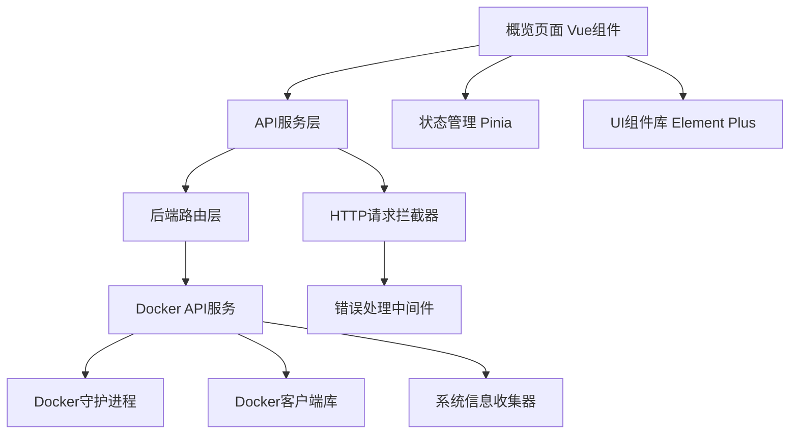
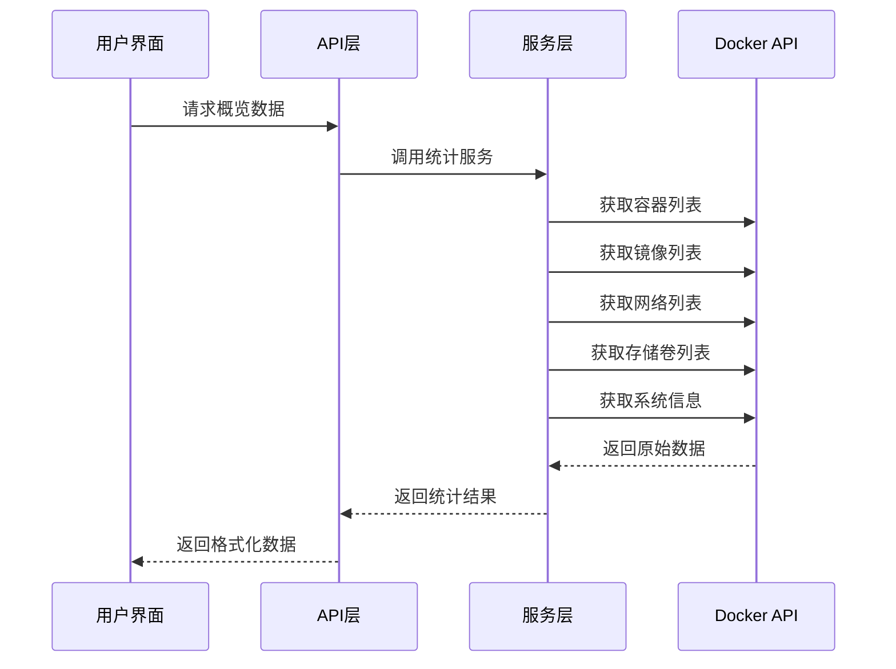

# Design Document

## Overview

Docker概览仪表板是一个综合性的监控界面，为用户提供Docker环境的实时状态概览。该设计基于1Panel的界面风格，采用现代化的卡片式布局，展示容器、镜像、网络、存储卷等关键指标的统计信息，以及系统配置的快速查看功能。

## Architecture

### 系统架构图



### 数据流架构



## Components and Interfaces

### 前端组件结构

#### 1. 主概览组件 (DockerOverview.vue)
```javascript
// 组件结构
{
  name: 'DockerOverview',
  components: {
    OverviewHeader,      // 页面头部
    StatisticsCards,     // 统计卡片区域
    ConfigurationPanel,  // 配置信息面板
    QuickActions        // 快速操作区域
  }
}
```

#### 2. 统计卡片组件 (StatisticsCards.vue)
```javascript
// 卡片数据结构
interface StatCard {
  title: string;        // 卡片标题
  value: number;        // 统计数值
  icon: string;         // 图标
  color: string;        // 主题色
  route?: string;       // 点击跳转路由
  loading: boolean;     // 加载状态
}
```

#### 3. 配置面板组件 (ConfigurationPanel.vue)
```javascript
// 配置信息结构
interface ConfigInfo {
  socketPath: string;           // Socket路径
  registryMirrors: string[];    // 镜像加速器
  storageDriver: string;        // 存储驱动
  cgroupDriver: string;         // Cgroup驱动
  version: string;              // Docker版本
}
```

### API接口设计

#### 1. 概览统计API
```javascript
// GET /api/v1/docker/overview
{
  "code": 0,
  "data": {
    "containers": {
      "total": 7,
      "running": 5,
      "stopped": 2
    },
    "images": {
      "total": 8,
      "size": "4.38 GB"
    },
    "networks": {
      "total": 5
    },
    "volumes": {
      "total": 2
    },
    "system": {
      "version": "20.10.21",
      "storageDriver": "overlay2",
      "cgroupDriver": "systemd"
    }
  }
}
```

#### 2. 配置信息API
```javascript
// GET /api/v1/docker/config/summary
{
  "code": 0,
  "data": {
    "socketPath": "unix:///var/run/docker.sock",
    "registryMirrors": [
      "https://docker.1panel.live"
    ],
    "storageDriver": "overlay2",
    "cgroupDriver": "systemd",
    "version": "20.10.21",
    "dataRoot": "/var/lib/docker"
  }
}
```

### 后端服务接口

#### 1. 概览服务 (DockerOverviewService)
```go
type DockerOverviewService struct {
    dockerClient *client.Client
}

type OverviewStats struct {
    Containers ContainerStats `json:"containers"`
    Images     ImageStats     `json:"images"`
    Networks   NetworkStats   `json:"networks"`
    Volumes    VolumeStats    `json:"volumes"`
    System     SystemStats    `json:"system"`
}

func (s *DockerOverviewService) GetOverviewStats() (*OverviewStats, error)
```

#### 2. API控制器 (DockerOverviewApi)
```go
type DockerOverviewApi struct{}

func (d *DockerOverviewApi) GetOverviewStats(c *gin.Context)
func (d *DockerOverviewApi) GetConfigSummary(c *gin.Context)
```

## Data Models

### 前端数据模型

#### 1. 概览状态模型
```typescript
interface OverviewState {
  statistics: {
    containers: ContainerStats;
    images: ImageStats;
    networks: NetworkStats;
    volumes: VolumeStats;
  };
  configuration: ConfigSummary;
  loading: {
    statistics: boolean;
    configuration: boolean;
  };
  lastUpdated: Date;
}
```

#### 2. 统计数据模型
```typescript
interface ContainerStats {
  total: number;
  running: number;
  stopped: number;
  paused: number;
}

interface ImageStats {
  total: number;
  size: string;
  sizeBytes: number;
}

interface NetworkStats {
  total: number;
  bridge: number;
  host: number;
  none: number;
}

interface VolumeStats {
  total: number;
  size: string;
  sizeBytes: number;
}
```

### 后端数据模型

#### 1. Go结构体定义
```go
type ContainerStats struct {
    Total   int `json:"total"`
    Running int `json:"running"`
    Stopped int `json:"stopped"`
    Paused  int `json:"paused"`
}

type ImageStats struct {
    Total     int    `json:"total"`
    Size      string `json:"size"`
    SizeBytes int64  `json:"sizeBytes"`
}

type NetworkStats struct {
    Total  int `json:"total"`
    Bridge int `json:"bridge"`
    Host   int `json:"host"`
    None   int `json:"none"`
}

type VolumeStats struct {
    Total     int    `json:"total"`
    Size      string `json:"size"`
    SizeBytes int64  `json:"sizeBytes"`
}
```

## Error Handling

### 前端错误处理策略

#### 1. API调用错误处理
```javascript
// 统一错误处理
const handleApiError = (error, context) => {
  console.error(`${context} 失败:`, error);
  
  if (error.response?.status === 500) {
    ElMessage.error('Docker服务连接失败，请检查Docker是否正常运行');
  } else if (error.response?.status === 403) {
    ElMessage.error('权限不足，无法访问Docker信息');
  } else {
    ElMessage.error(error.message || '获取数据失败');
  }
};
```

#### 2. 数据加载失败处理
```javascript
// 优雅降级显示
const loadOverviewData = async () => {
  try {
    loading.statistics = true;
    const result = await getDockerOverview();
    statistics.value = result.data;
  } catch (error) {
    handleApiError(error, '获取概览数据');
    // 显示错误状态，但不阻塞其他功能
    statistics.value = getDefaultStats();
  } finally {
    loading.statistics = false;
  }
};
```

### 后端错误处理策略

#### 1. Docker连接错误处理
```go
func (s *DockerOverviewService) GetOverviewStats() (*OverviewStats, error) {
    // 检查Docker连接
    if err := s.dockerClient.Ping(context.Background()); err != nil {
        return nil, fmt.Errorf("Docker服务连接失败: %w", err)
    }
    
    // 获取统计数据时的错误处理
    stats := &OverviewStats{}
    
    // 容器统计 - 即使失败也不影响其他统计
    if containerStats, err := s.getContainerStats(); err != nil {
        log.Printf("获取容器统计失败: %v", err)
        stats.Containers = ContainerStats{} // 默认值
    } else {
        stats.Containers = *containerStats
    }
    
    return stats, nil
}
```

#### 2. 权限错误处理
```go
func (d *DockerOverviewApi) GetOverviewStats(c *gin.Context) {
    stats, err := dockerOverviewService.GetOverviewStats()
    if err != nil {
        if strings.Contains(err.Error(), "permission denied") {
            response.FailWithMessage("权限不足，请检查Docker访问权限", c)
            return
        }
        response.FailWithMessage("获取Docker概览数据失败: "+err.Error(), c)
        return
    }
    
    response.OkWithData(stats, c)
}
```

## Testing Strategy

### 前端测试策略

#### 1. 单元测试
```javascript
// 组件测试
describe('DockerOverview.vue', () => {
  test('应该正确显示统计数据', async () => {
    const mockStats = {
      containers: { total: 5, running: 3, stopped: 2 },
      images: { total: 8, size: '4.38 GB' }
    };
    
    const wrapper = mount(DockerOverview, {
      global: {
        mocks: {
          $api: {
            getDockerOverview: () => Promise.resolve({ data: mockStats })
          }
        }
      }
    });
    
    await wrapper.vm.$nextTick();
    expect(wrapper.find('.container-total').text()).toBe('5');
  });
});
```

#### 2. 集成测试
```javascript
// API集成测试
describe('Docker Overview API', () => {
  test('应该能够获取概览数据', async () => {
    const result = await getDockerOverview();
    expect(result.code).toBe(0);
    expect(result.data).toHaveProperty('containers');
    expect(result.data).toHaveProperty('images');
  });
});
```

### 后端测试策略

#### 1. 服务层测试
```go
func TestDockerOverviewService_GetOverviewStats(t *testing.T) {
    // 模拟Docker客户端
    mockClient := &MockDockerClient{}
    service := &DockerOverviewService{dockerClient: mockClient}
    
    // 设置模拟数据
    mockClient.On("ContainerList").Return([]types.Container{
        {State: "running"},
        {State: "exited"},
    }, nil)
    
    stats, err := service.GetOverviewStats()
    assert.NoError(t, err)
    assert.Equal(t, 2, stats.Containers.Total)
    assert.Equal(t, 1, stats.Containers.Running)
}
```

#### 2. API层测试
```go
func TestDockerOverviewApi_GetOverviewStats(t *testing.T) {
    router := gin.New()
    api := &DockerOverviewApi{}
    router.GET("/overview", api.GetOverviewStats)
    
    req := httptest.NewRequest("GET", "/overview", nil)
    w := httptest.NewRecorder()
    router.ServeHTTP(w, req)
    
    assert.Equal(t, 200, w.Code)
    
    var response map[string]interface{}
    json.Unmarshal(w.Body.Bytes(), &response)
    assert.Equal(t, float64(0), response["code"])
}
```

### 性能测试

#### 1. 前端性能测试
- 页面加载时间测试
- 数据刷新性能测试
- 内存泄漏检测

#### 2. 后端性能测试
- API响应时间测试
- 并发请求处理测试
- Docker API调用优化测试

## Implementation Notes

### 技术选型说明

1. **前端框架**: Vue 3 + Composition API
2. **UI组件库**: Element Plus
3. **状态管理**: Pinia
4. **HTTP客户端**: Axios
5. **后端框架**: Gin
6. **Docker客户端**: Docker Go SDK

### 性能优化考虑

1. **数据缓存**: 统计数据缓存30秒，减少Docker API调用频率
2. **懒加载**: 配置信息按需加载
3. **防抖处理**: 用户操作防抖，避免频繁请求
4. **错误重试**: 网络错误自动重试机制

### 安全考虑

1. **权限验证**: 所有API调用需要验证用户权限
2. **输入验证**: 后端严格验证所有输入参数
3. **错误信息**: 不暴露敏感的系统信息
4. **访问控制**: 基于角色的访问控制