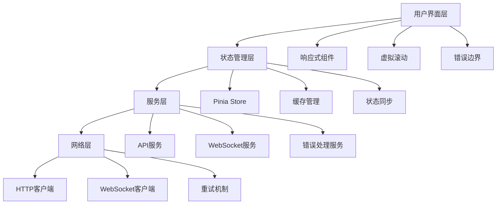

# 前端优化设计文档

## 概述

本文档描述了Ollama模型管理系统前端优化的技术设计方案，重点解决错误处理、响应式设计、WebSocket稳定性和性能优化等关键问题。

## 架构设计

### 整体架构优化



## 组件设计

### 1. 增强错误处理系统

#### 错误处理架构
```javascript
// 错误处理中心
class ErrorHandlingCenter {
  // 错误分类和处理策略
  static errorStrategies = {
    NETWORK_ERROR: {
      retry: true,
      maxRetries: 3,
      showNotification: true,
      fallbackAction: 'showOfflineMode'
    },
    VALIDATION_ERROR: {
      retry: false,
      showInlineError: true,
      focusField: true
    },
    PERMISSION_ERROR: {
      retry: false,
      redirectTo: '/login',
      showModal: true
    }
  }
}
```

#### 用户反馈组件设计
- **Toast通知系统**：分层显示不同类型的消息
- **进度指示器**：统一的加载状态管理
- **确认对话框**：危险操作的二次确认
- **内联错误提示**：表单验证错误的即时反馈

### 2. 响应式设计系统

#### 断点设计
```scss
$breakpoints: (
  xs: 0,
  sm: 576px,
  md: 768px,
  lg: 992px,
  xl: 1200px,
  xxl: 1400px
);
```

#### 自适应组件策略
- **表格 → 卡片**：小屏幕下表格转换为卡片布局
- **侧边栏 → 抽屉**：导航菜单在移动端使用抽屉模式
- **工具栏 → 底部栏**：操作按钮在移动端移至底部
- **搜索面板 → 折叠式**：高级搜索在移动端采用折叠设计

### 3. WebSocket连接管理

#### 连接状态管理
```javascript
class WebSocketManager {
  constructor() {
    this.connectionState = 'disconnected'
    this.reconnectAttempts = 0
    this.maxReconnectAttempts = 5
    this.heartbeatInterval = 30000
    this.reconnectDelay = 1000
  }
  
  // 智能重连策略
  reconnect() {
    const delay = Math.min(1000 * Math.pow(2, this.reconnectAttempts), 30000)
    setTimeout(() => this.connect(), delay)
  }
}
```

#### 消息队列和缓存
- **离线消息队列**：网络断开时缓存待发送消息
- **消息去重**：防止重复消息处理
- **状态同步**：连接恢复后同步最新状态

### 4. 虚拟滚动实现

#### 虚拟滚动组件架构
```javascript
class VirtualScroller {
  constructor(options) {
    this.itemHeight = options.itemHeight || 60
    this.bufferSize = options.bufferSize || 5
    this.visibleRange = { start: 0, end: 0 }
    this.scrollTop = 0
  }
  
  // 计算可见项目范围
  calculateVisibleRange() {
    const containerHeight = this.containerRef.clientHeight
    const start = Math.floor(this.scrollTop / this.itemHeight)
    const visibleCount = Math.ceil(containerHeight / this.itemHeight)
    
    return {
      start: Math.max(0, start - this.bufferSize),
      end: Math.min(this.totalItems, start + visibleCount + this.bufferSize)
    }
  }
}
```

#### 性能优化策略
- **动态高度支持**：支持不同高度的列表项
- **滚动位置保持**：数据更新时保持滚动位置
- **预加载机制**：接近底部时自动加载更多数据

## 数据模型

### 错误状态模型
```typescript
interface ErrorState {
  type: 'network' | 'validation' | 'permission' | 'server' | 'unknown'
  code: string
  message: string
  suggestion: string
  retryable: boolean
  timestamp: number
  context: string
}
```

### 连接状态模型
```typescript
interface ConnectionState {
  status: 'connecting' | 'connected' | 'disconnected' | 'error'
  lastConnected: number
  reconnectAttempts: number
  latency: number
  messageQueue: Message[]
}
```

### 虚拟滚动状态模型
```typescript
interface VirtualScrollState {
  totalItems: number
  visibleRange: { start: number; end: number }
  itemHeight: number
  scrollTop: number
  containerHeight: number
  estimatedTotalHeight: number
}
```

## 错误处理策略

### 错误分类和处理
1. **网络错误**
   - 自动重试机制
   - 离线模式支持
   - 网络状态检测

2. **验证错误**
   - 实时表单验证
   - 字段级错误提示
   - 输入建议和自动修正

3. **权限错误**
   - 自动跳转登录
   - 权限提示说明
   - 临时访客模式

4. **服务器错误**
   - 错误报告收集
   - 降级功能提供
   - 管理员通知

### 用户反馈机制
- **即时反馈**：操作结果的即时显示
- **进度反馈**：长时间操作的进度显示
- **状态反馈**：系统状态的实时更新
- **帮助反馈**：操作指导和帮助信息

## 测试策略

### 单元测试
- 错误处理函数测试
- 响应式工具函数测试
- WebSocket连接管理测试
- 虚拟滚动计算逻辑测试

### 集成测试
- 组件交互测试
- 状态管理测试
- API集成测试
- WebSocket消息处理测试

### 端到端测试
- 用户操作流程测试
- 错误场景测试
- 性能基准测试
- 移动端兼容性测试

### 性能测试
- 虚拟滚动性能测试
- 内存使用监控
- 网络请求优化验证
- 渲染性能测试

## 监控和分析

### 性能监控
- 页面加载时间
- 组件渲染时间
- 内存使用情况
- 网络请求统计

### 错误监控
- 错误发生频率
- 错误类型分布
- 用户影响分析
- 修复效果跟踪

### 用户体验监控
- 操作成功率
- 用户停留时间
- 功能使用统计
- 移动端使用情况

## 部署和维护

### 渐进式部署
1. **阶段1**：错误处理优化
2. **阶段2**：响应式设计改进
3. **阶段3**：WebSocket稳定性增强
4. **阶段4**：虚拟滚动实现

### 向后兼容
- 功能开关控制
- 渐进式增强
- 降级方案支持
- 用户偏好保存

### 维护策略
- 定期性能审计
- 用户反馈收集
- 错误日志分析
- 持续优化改进